# Distributed P2P Machine Learning Training Platform

A peer-to-peer distributed machine learning training system that enables collaborative model training across multiple nodes using message queues, cloud storage, and coordinated worker processes.

## Table of Contents

- [Overview](#overview)
- [System Architecture](#system-architecture)
- [Features](#features)
- [Tech Stack](#tech-stack)
- [Prerequisites](#prerequisites)
- [Installation](#installation)

## Overview

This platform allows users to:
- Create distributed training sessions with multiple peer workers
- Upload datasets for collaborative training
- Track real-time training progress with heartbeats
- Collect and aggregate results from multiple workers
- Manage training sessions through a REST API

## System Architecture

```mermaid
flowchart TD
    Start([User Opens App]) --> Login[User Login/Signup]
    
    Login --> AuthAPI[POST /auth/signin or /auth/signup]
    AuthAPI --> JWT[Generate JWT Token]
    JWT --> Dashboard[User Dashboard]
    
    Dashboard --> CreateSession[POST /sessions/start]
    
    CreateSession --> ValidateUser{User Exists?}
    ValidateUser -->|No| Error1[Return 404 Error]
    ValidateUser -->|Yes| CheckPeers{Enough Online<br/>Peers Available?}
    
    CheckPeers -->|No| Error2[Return 400:<br/>Not Enough Peers]
    CheckPeers -->|Yes| CreateSessionDoc[Create Session Document<br/>in MongoDB]
    
    CreateSessionDoc --> LockPeers[Lock Peers:<br/>Set Status = TRAINING]
    LockPeers --> SaveCSV[Save Uploaded CSV<br/>to Temp File]
    SaveCSV --> SpawnBG[Spawn Background Process]
    
    SpawnBG --> UploadS3[Upload CSV to S3<br/>s3://bucket/timestamp.csv]
    UploadS3 --> UpdateSession[Update Session with<br/>Dataset Metadata]
    UpdateSession --> StartCoord[Start Coordinator Process]
    
    StartCoord --> ConnectRabbit[Connect to RabbitMQ]
    ConnectRabbit --> DeclareQueue[Declare Event Queue:<br/>coordinator.uid.events]
    DeclareQueue --> EnablePeers[Send ENABLE Command<br/>to All Peers]
    
    EnablePeers --> EnableMsg{{"type: ENABLE<br/>queue: coordinator.uid.events"}}
    EnableMsg --> Worker1[Peer Worker 1]
    EnableMsg --> Worker2[Peer Worker 2]
    EnableMsg --> WorkerN[Peer Worker N]
    
    Worker1 --> W1Listen[Listen to:<br/>peer.uid1.command]
    Worker2 --> W2Listen[Listen to:<br/>peer.uid2.command]
    WorkerN --> WNListen[Listen to:<br/>peer.uidN.command]
    
    W1Listen --> W1Enable[Attach to Event Queue]
    W2Listen --> W2Enable[Attach to Event Queue]
    WNListen --> WNEnable[Attach to Event Queue]
    
    W1Enable --> SendTrain[Coordinator Sends<br/>TRAIN Command]
    W2Enable --> SendTrain
    WNEnable --> SendTrain
    
    SendTrain --> TrainMsg{{"type: TRAIN<br/>csv_link: s3://...<br/>batch_size: 64<br/>epochs: 10<br/>lr: 0.001"}}
    
    TrainMsg --> W1Train[Worker 1 Training]
    TrainMsg --> W2Train[Worker 2 Training]
    TrainMsg --> WNTrain[Worker N Training]
    
    W1Train --> W1Download[Download Dataset<br/>from S3]
    W1Download --> W1DNN[Load SimpleDNN Model]
    W1DNN --> W1Loop[Training Loop]
    
    W1Loop --> W1Epoch{For Each Epoch}
    W1Epoch --> W1Forward[Forward Pass]
    W1Forward --> W1Loss[Calculate Loss]
    W1Loss --> W1Backward[Backward Pass]
    W1Backward --> W1Update[Update Weights]
    W1Update --> W1Heartbeat[Send Heartbeat with<br/>Epoch, Loss, Accuracy]
    
    W1Heartbeat --> EventQueue[coordinator.uid.events]
    W2Train --> EventQueue
    WNTrain --> EventQueue
    
    EventQueue --> CoordCollect[Coordinator Collects Results]
    CoordCollect --> UpdateMongo[Update MongoDB:<br/>- peers.results<br/>- session.results]
    
    W1Epoch -->|More Epochs| W1Forward
    W1Epoch -->|Complete| W1Done[Send DONE Message]
    
    W1Done --> EventQueue
    
    CoordCollect --> CheckComplete{All Peers<br/>Completed?}
    CheckComplete -->|No| CoordCollect
    CheckComplete -->|Yes| SendStop[Send STOP Command<br/>to All Peers]
    
    SendStop --> UpdateStatus[Update Session Status<br/>to COMPLETED]
    UpdateStatus --> CloseRabbit[Close RabbitMQ<br/>Connection]
    CloseRabbit --> End([Training Complete])
    
    Dashboard --> CheckStatus[GET /sessions/training-status]
    CheckStatus --> StatusCheck{Session Status}
    StatusCheck -->|RUNNING| ShowTraining[Display: Training in Progress]
    StatusCheck -->|COMPLETED| ShowComplete[Display: Training Completed]
    
    style Start fill:#e1f5ff,stroke:#0066cc,stroke-width:3px
    style End fill:#e1f5ff,stroke:#0066cc,stroke-width:3px
    style Login fill:#fff4e6,stroke:#ff9800,stroke-width:2px
    style CreateSession fill:#fff4e6,stroke:#ff9800,stroke-width:2px
    style CreateSessionDoc fill:#f3e5f5,stroke:#9c27b0,stroke-width:2px
    style UpdateMongo fill:#f3e5f5,stroke:#9c27b0,stroke-width:2px
    style ConnectRabbit fill:#e8f5e9,stroke:#4caf50,stroke-width:2px
    style EventQueue fill:#e8f5e9,stroke:#4caf50,stroke-width:2px
    style UploadS3 fill:#fff3e0,stroke:#ff6f00,stroke-width:2px
    style W1Download fill:#fff3e0,stroke:#ff6f00,stroke-width:2px
    style W1Train fill:#fce4ec,stroke:#e91e63,stroke-width:2px
    style W2Train fill:#fce4ec,stroke:#e91e63,stroke-width:2px
    style WNTrain fill:#fce4ec,stroke:#e91e63,stroke-width:2px
    style StartCoord fill:#ffebee,stroke:#c62828,stroke-width:2px
    style CoordCollect fill:#ffebee,stroke:#c62828,stroke-width:2px
    style Error1 fill:#ffcdd2,stroke:#d32f2f,stroke-width:2px
    style Error2 fill:#ffcdd2,stroke:#d32f2f,stroke-width:2px
```



## Features

### Core Features
- **Distributed Training**: Train ML models across multiple peer workers simultaneously
- **Real-time Monitoring**: Track training progress with epoch-level metrics
- **Secure Authentication**: JWT-based authentication system
- **Cloud Storage Integration**: S3 for dataset storage and distribution
- **Message Queue Architecture**: RabbitMQ for reliable inter-process communication
- **Database Persistence**: MongoDB for storing user data, sessions, and results

### Training Features
- **Configurable Hyperparameters**: Set batch size, epochs, learning rate per peer
- **SimpleDNN Model**: Fully-connected neural network with customizable dimensions
- **PyTorch Backend**: Leverages PyTorch for efficient model training
- **GPU Support**: Automatic GPU detection and utilization
- **Heartbeat System**: Real-time training status updates

## Tech Stack

### Backend
- **FastAPI** - Modern web framework for building APIs
- **Python 3.8+** - Core programming language
- **PyTorch** - Deep learning framework
- **aio-pika** - Asynchronous RabbitMQ client

### Infrastructure
- **MongoDB Atlas** - Cloud database for data persistence
- **RabbitMQ** - Message broker for inter-process communication
- **AWS S3** - Object storage for datasets
- **Boto3** - AWS SDK for Python

### Security
- **JWT** - JSON Web Tokens for authentication
- **bcrypt** - Password hashing
- **TLS/SSL** - Encrypted message queue connections

## Prerequisites

- Python 3.8 or higher
- MongoDB Atlas account
- RabbitMQ instance (CloudAMQP or self-hosted)
- AWS account with S3 bucket
- pip package manager

## Installation

### Option 1: Local Installation

1. **Install Dependencies**
```bash
make build
```

2. **Start Server**
```bash
make run
```

### Option 2: Docker Compose

1. **Start with Docker Compose**
```bash
docker-compose up -d
```

2. **Stop services**
```bash
docker-compose down
```